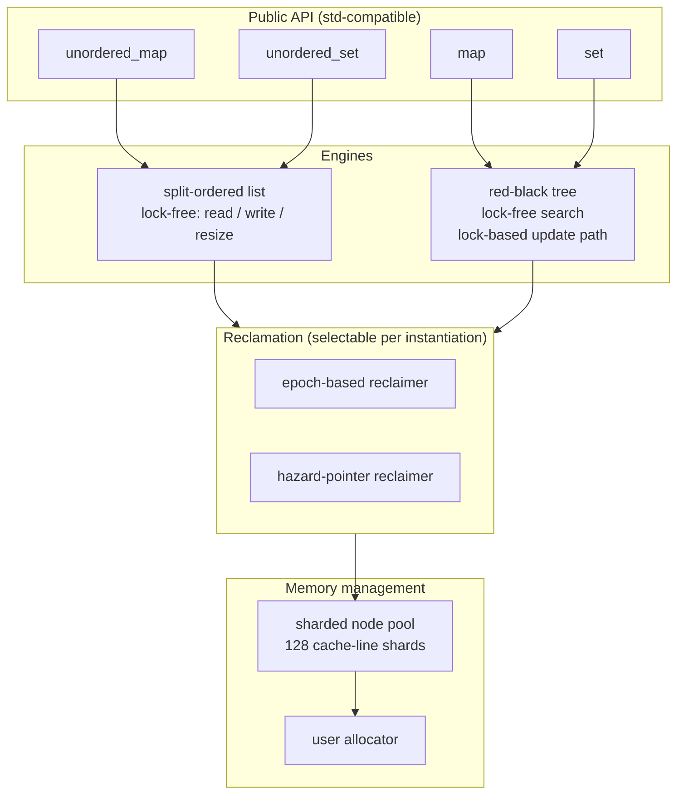
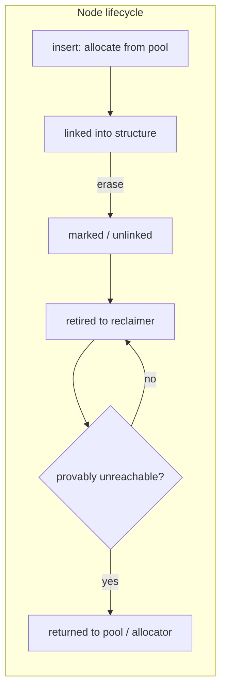

# mpmc_map

Header-only, thread-safe containers for C++11, designed for
multi-producer / multi-consumer workloads. Four containers are
provided, built on two lock-free engine designs:

| Container                | Header                            | Engine                       |
|--------------------------|-----------------------------------|------------------------------|
| `mpmc::unordered_map`    | `mpmc/mpmc_unordered_map.hpp`     | split-ordered list (lock-free, including resize) |
| `mpmc::unordered_set`    | `mpmc/mpmc_unordered_set.hpp`     | split-ordered list (lock-free, including resize) |
| `mpmc::map`              | `mpmc/mpmc_map.hpp`               | concurrent red-black tree (lock-free search, lock-based update path) |
| `mpmc::set`              | `mpmc/mpmc_set.hpp`               | concurrent red-black tree (lock-free search, lock-based update path) |

The library is single-header-per-container, depends only on the C++11
standard library and threads, and is MIT licensed.

A Chinese version of this document is available in [README_CN.md](README_CN.md).

## Scope and limitations

This library targets **concurrent read and write access to a single
shared container instance** from multiple threads, without external
locking. The following properties are documented and tested:

- the data structures are safe for concurrent use by any number of
  threads;
- the unordered containers are fully lock-free in the sense that every
  operation makes progress on its own (no mutex, no wait) -- including
  the resize path;
- the ordered containers provide lock-free search and a
  deadlock-free, hand-over-hand update path that serializes writers
  per tree path;
- memory reclamation is handled internally (epoch or hazard pointers),
  so callers never manage node lifetimes.

The library is **not**:

- a drop-in replacement for `std::unordered_map`/`std::map` in
  single-threaded code -- the lock-free machinery has a measurable
  per-operation cost (see [Performance](#performance));
- a copyable or movable container -- all four containers are
  non-copyable and non-movable by design (shared ownership model);
- a persistence or transactional store.

## Architecture



Both engines are `std::`-like containers whose nodes are allocated
through the user-provided allocator and recycled through an internal
per-instantiation node pool. The pool is the only component that uses
short spin locks (for bookkeeping only); the container data structures
themselves contain no locks.

## Quick start

```cpp
#include "mpmc/mpmc_unordered_map.hpp"
#include "mpmc/mpmc_map.hpp"

// Unordered: fully lock-free, including resize.
mpmc::unordered_map<int, int> counts;
counts[42] = 1;

// Ordered: lock-free reads, deadlock-free updates.
mpmc::map<int, int> table;
table.insert(std::make_pair(7, 70));
auto it = table.find(7);
```

Both containers are safe to share across threads without external
locking. See [docs/API_en.md](docs/API_en.md) for the complete
interface and its documented deviations from the standard containers.

## Reclamation schemes

Retired nodes are never freed immediately: an object is returned to
the allocator only after it is provably unreachable from every
concurrent operation. Two schemes implement this proof:

- **Epoch-based reclamation** (default): every operation runs inside a
  generation guard; a node is freed when the global generation has
  advanced two steps beyond the generation it was retired in.
- **Hazard pointers**: each thread publishes the nodes it is currently
  dereferencing; a node is freed when no live hazard slot references it.



The scheme is selected per instantiation through the last template
parameter (`mpmc::reclamation::epoch` or
`mpmc::reclamation::hazard_pointer`); the default is chosen by
measurement, documented in [docs/PERF_en.md](docs/PERF_en.md).

## Performance

Measured on the development machine (clang 17, Release, Windows x64)
with the `bench_unordered` harness at 2M operations per thread.
Background load fluctuates on that machine; the numbers below are
indicative single runs, not a guarantee.

| Threads | mixed, vs `std::unordered_map`+mutex | read-heavy, vs `std::unordered_map`+mutex |
|---------|--------------------------------------|-------------------------------------------|
| 1       | 0.58-0.63x                           | 0.60-0.66x                                |
| 2       | 0.79-0.94x                           | 1.10-1.33x                                |
| 4       | 1.09x                                | 2.02-3.73x                                |
| 8       | 1.26x                                | 2.42-10.11x                               |

Two consequences follow from the measurements and are worth stating
explicitly:

1. Single-threaded use is slower than the standard containers. The
   gap (roughly 1.6x for unordered) is the price of lock-free
   linearizability: tag bits, CAS-based mutation, and reclamation
   guards.
2. The unordered containers scale well for read-heavy workloads and
   overtake `std`+mutex from 2-4 threads; mixed (write-heavy)
   workloads overtake from 4 threads on this machine. Above that, the
   aggregate throughput saturates around 40M operations/s across 4-16
   threads (the shared list and its counters are the structural
   bound).

Full methodology, the tree benchmarks, and the reclamation-scheme
comparison are in [docs/PERF_en.md](docs/PERF_en.md).

## Verification

The verification matrix runs on every change and is documented in
[docs/PERF_en.md](docs/PERF_en.md). Summary:

- 10 test suites (ctest), including randomized oracle tests against
  `std` containers, concurrent stress tests with per-key oracles and
  RNG replay, red-black balance validation, and leak checks with a
  counting allocator (allocate == deallocate asserted);
- a configure-time negative compile test (keys with throwing copy
  constructors are rejected);
- undefined-behavior sanitizer (clang) and AddressSanitizer (MSVC)
  runs of the full suite;
- MSVC `/W4 /WX /utf-8` warning-clean compilation of all test sources
  (library headers are pure ASCII; the only suppressed warning, C4324,
  flags the intentional cache-line alignment);
- 16-thread stress runs (both engines, both reclamation schemes) with
  the counting-allocator balance and per-key state oracle.

## Building and testing

```sh
cmake -S . -B build -G Ninja -DCMAKE_CXX_COMPILER=clang++
cmake --build build
ctest --test-dir build          # 10 test suites
./build/bench_reclamation       # reclamation benchmarks
./build/bench_unordered         # unordered benchmarks vs std+mutex
./build/bench_tree              # tree benchmarks vs std+mutex
./build/microbench              # single-thread microbenchmarks
```

Sanitizer builds: configure with `-DMPMC_SANITIZE=ON` (clang UBSan).
The MSVC AddressSanitizer workflow uses `cl /fsanitize=address`
(vcvars64 environment, `ASAN_WIN_CONTINUE_ON_INTERCEPTION_FAILURE=1`).

Stress tests accept an optional thread count as the second argument
(`stress_unordered 1000000 16`), which is how the 16-thread matrix is
run.

## Requirements

- C++11 (clang 17 and MSVC 2022 are tested; any conforming compiler
  with `<atomic>` and `<thread>` should work);
- `Key` and mapped types must be nothrow-copy-constructible and
  nothrow-destructible (enforced by `static_assert`);
- the primary development platform is Windows; the code uses only
  portable C++11 (TSan is unavailable on Windows and was not part of
  the verification matrix).

## Documentation

| Document | Contents |
|----------|----------|
| [docs/API_en.md](docs/API_en.md) | Complete API reference and deviations from `std` |
| [docs/DESIGN_en.md](docs/DESIGN_en.md) | Engine designs and correctness arguments |
| [docs/RECLAMATION_en.md](docs/RECLAMATION_en.md) | Reclamation schemes and how the default was chosen |
| [docs/PERF_en.md](docs/PERF_en.md) | Benchmark methodology and results |
| [README_CN.md](README_CN.md) | This document in Chinese |

Chinese versions of the design, reclamation and performance documents
are available as `*_zh.md` alongside the English originals.

## License

MIT. See [LICENSE](LICENSE).
