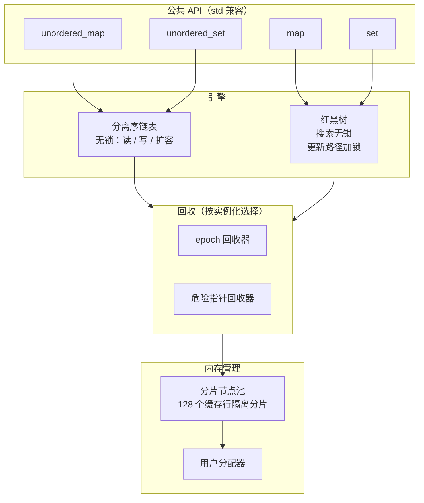
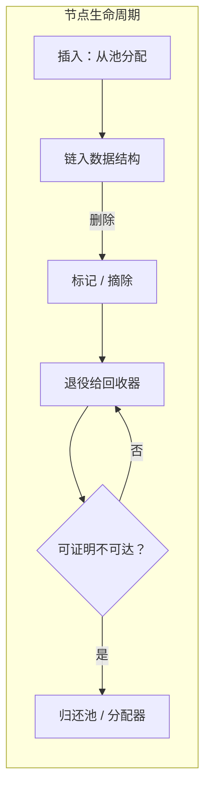

# mpmc_map

面向 C++11 的头文件库线程安全容器，针对多生产者 / 多消费者（MPMC）负载设计。库提供四个容器，构建于两种无锁引擎设计之上：

| 容器                     | 头文件                              | 引擎                          |
|--------------------------|-------------------------------------|-------------------------------|
| `mpmc::unordered_map`    | `mpmc/mpmc_unordered_map.hpp`       | 分离序链表（无锁，含扩容）      |
| `mpmc::unordered_set`    | `mpmc/mpmc_unordered_set.hpp`       | 分离序链表（无锁，含扩容）      |
| `mpmc::map`              | `mpmc/mpmc_map.hpp`                 | 并发红黑树（搜索无锁，更新路径加锁）|
| `mpmc::set`              | `mpmc/mpmc_set.hpp`                 | 并发红黑树（搜索无锁，更新路径加锁）|

每个容器一个头文件，除 C++11 标准库与线程外无其他依赖，MIT 许可。

本文档的英文版本见 [README.md](README.md)。

## 适用范围与限制

本库的目标是**多个线程在没有外部锁的情况下并发读写同一个共享容器实例**。以下性质经过文档化与测试：

- 数据结构对任意数量的线程并发使用是安全的；
- 无序容器完全无锁——每次操作独立推进（无互斥、无等待），包括扩容路径；
- 有序容器提供无锁搜索，以及无死锁的逐段（hand-over-hand）更新路径，写者在每条树路径上串行化；
- 内存回收由库内部处理（epoch 或危险指针），调用方无需管理节点生命周期。

本库**不是**：

- 单线程场景下 `std::unordered_map`/`std::map` 的即插即用替代品——无锁机制有可测量的每操作开销（见[性能](#性能)）；
- 可复制或可移动的容器——四个容器均不可复制、不可移动（共享所有权模型的设计使然）；
- 持久化或事务存储。

## 架构



两个引擎的节点均通过用户提供的分配器分配，并经内部的按实例化共享节点池回收。节点池是唯一使用短自旋锁的组件（仅用于簿记）；容器数据结构本身不含任何锁。

## 快速开始

```cpp
#include "mpmc/mpmc_unordered_map.hpp"
#include "mpmc/mpmc_map.hpp"

// 无序：完全无锁，含扩容。
mpmc::unordered_map<int, int> counts;
counts[42] = 1;

// 有序：读无锁，更新无死锁。
mpmc::map<int, int> table;
table.insert(std::make_pair(7, 70));
auto it = table.find(7);
```

两个容器均可跨线程共享而无需外部锁。完整接口及其与标准容器的已文档化差异见 [docs/API_zh.md](docs/API_zh.md)。

## 回收方案

退役节点不会立即释放：只有在可证明任何并发操作都无法再到达该对象时，才将其归还分配器。两种方案实现这一证明：

- **epoch 回收**（默认）：每次操作在代际守卫内运行；当全局代际较节点退役时的代际前进两步后，该节点才被释放。
- **危险指针**：每个线程发布其当前正在解引用的节点；当没有任何活跃的危险槽引用某节点时，该节点才被释放。



方案通过最后一个模板参数按实例化选择（`mpmc::reclamation::epoch` 或 `mpmc::reclamation::hazard_pointer`）；默认方案由测量决定，见 [docs/PERF_zh.md](docs/PERF_zh.md)。

## 性能

在开发机（clang 17，Release，Windows x64）上以 `bench_unordered` 压测，每线程 200 万次操作。该机器后台负载存在波动，以下数字为有代表性的单次运行，不代表保证值。

| 线程数 | 混合负载 vs `std::unordered_map`+mutex | 读多负载 vs `std::unordered_map`+mutex |
|--------|-----------------------------------------|----------------------------------------|
| 1      | 0.58-0.63x                              | 0.60-0.66x                             |
| 2      | 0.79-0.94x                              | 1.10-1.33x                             |
| 4      | 1.09x                                   | 2.02-3.73x                             |
| 8      | 1.26x                                   | 2.42-10.11x                            |

测量结果给出两点明确结论：

1. 单线程使用慢于标准容器。差距（无序约 1.6x）是无锁线性一致性的代价：标签位、基于 CAS 的变更与回收守卫。
2. 无序容器在读多负载下扩展良好，在本机上从 2-4 线程起超越 `std`+mutex；混合（写重）负载从 4 线程起超越。此后总吞吐在 4-16 线程区间饱和于约 4000 万操作/秒（共享链表及其计数器是结构性上限）。

完整方法学、树容器基准与回收方案对比见 [docs/PERF_zh.md](docs/PERF_zh.md)。

## 验证

每次变更都会运行验证矩阵，记录于 [docs/PERF_zh.md](docs/PERF_zh.md)。摘要：

- 10 套测试（ctest），包括对 `std` 容器的随机化 oracle 测试、带逐键 oracle 与 RNG 重放的并发压力测试、红黑平衡校验、以及用计数分配器（断言 allocate == deallocate）的泄漏检查；
- 配置期负编译测试（复制构造会抛出的键类型必须被拒绝）；
- 全套测试的未定义行为消毒器（clang）与 AddressSanitizer（MSVC）运行；
- MSVC `/W4 /WX /utf-8` 零警告编译全部测试源（库头文件为纯 ASCII；唯一被抑制的警告 C4324 是有意为之的缓存行对齐）；
- 16 线程压力运行（两个引擎 × 两种回收方案），带计数分配器平衡与逐键状态 oracle。

## 构建与测试

```sh
cmake -S . -B build -G Ninja -DCMAKE_CXX_COMPILER=clang++
cmake --build build
ctest --test-dir build          # 10 套测试
./build/bench_reclamation       # 回收方案基准
./build/bench_unordered         # 无序容器基准 vs std+mutex
./build/bench_tree              # 树容器基准 vs std+mutex
./build/microbench              # 单线程微基准
```

消毒器构建：配置时加 `-DMPMC_SANITIZE=ON`（clang UBSan）。MSVC AddressSanitizer 工作流使用 `cl /fsanitize=address`（vcvars64 环境，`ASAN_WIN_CONTINUE_ON_INTERCEPTION_FAILURE=1`）。

压力测试可选第二个参数指定线程数（`stress_unordered 1000000 16`），16 线程矩阵即以此方式运行。

## 要求

- C++11（已测试 clang 17 与 MSVC 2022；任何具备 `<atomic>` 与 `<thread>` 的符合标准编译器均应可用）；
- `Key` 与映射类型必须不抛复制构造、不抛析构（由 `static_assert` 强制）；
- 主要开发平台为 Windows；代码仅使用可移植 C++11（Windows 上无 TSan，未纳入验证矩阵）。

## 文档

| 文档 | 内容 |
|------|------|
| [docs/API_zh.md](docs/API_zh.md) | 完整 API 参考及与 `std` 的差异 |
| [docs/DESIGN_zh.md](docs/DESIGN_zh.md) | 引擎设计与正确性论证 |
| [docs/RECLAMATION_zh.md](docs/RECLAMATION_zh.md) | 回收方案与默认方案的选择依据 |
| [docs/PERF_zh.md](docs/PERF_zh.md) | 基准方法学与结果 |
| [README.md](README.md) | 本文档的英文版本 |

## 许可

MIT。见 [LICENSE](LICENSE)。
