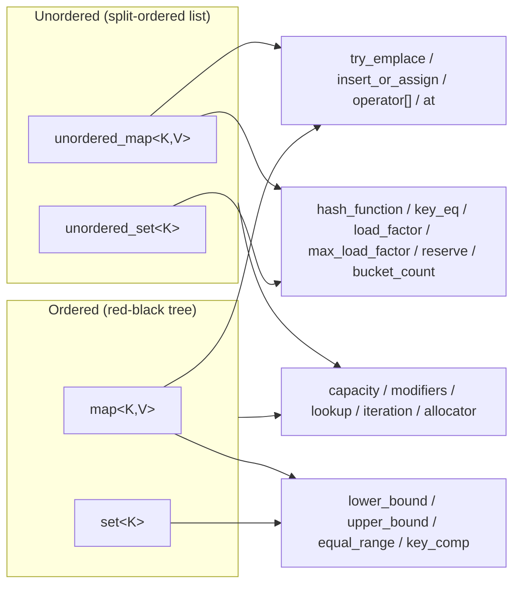

# API Reference

The library provides four concurrent containers in the `mpmc` namespace,
each in a single header:

| Container            | Header                    | Underlying engine            |
|----------------------|---------------------------|------------------------------|
| `mpmc::unordered_map` | `mpmc/mpmc_unordered_map.hpp` | lock-free split-ordered list |
| `mpmc::unordered_set` | `mpmc/mpmc_unordered_set.hpp` | lock-free split-ordered list |
| `mpmc::map`          | `mpmc/mpmc_map.hpp`       | concurrent red-black tree    |
| `mpmc::set`          | `mpmc/mpmc_set.hpp`       | concurrent red-black tree    |

All containers are header-only, C++11, single-header-per-container, MIT
licensed, and thread-safe for concurrent use by any number of threads.
The API mirrors the corresponding `std` containers; the differences are
listed in [Deviations from std](#deviations-from-std).



## Template parameters

```cpp
template <typename Key,
          typename T,
          typename Hash   = std::hash<Key>,
          typename KeyEqual = std::equal_to<Key>,
          typename Allocator = std::allocator<std::pair<const Key, T>>,
          typename Reclamation = mpmc::reclamation::default_scheme>
class unordered_map;

template <typename Key,
          typename Compare = std::less<Key>,
          typename Allocator = std::allocator<std::pair<const Key, Key>>,
          typename Reclamation = mpmc::reclamation::default_scheme>
class map;
```

`mpmc::unordered_set` and `mpmc::set` follow the same pattern with the
value type in place of the mapped type.

* `Reclamation` is `mpmc::reclamation::hazard_pointer` or
  `mpmc::reclamation::epoch` (see docs/RECLAMATION_en.md). The default is
  chosen from the benchmark results in docs/PERF_en.md.
* `Key` must be nothrow-copy-constructible and nothrow-destructible
  (enforced by `static_assert`); the same requirement applies to the
  mapped type `T`. Values are never copied inside locked or
  traversal-protected regions.
* Iterators and references remain valid until the referenced element is
  erased. There are no stable-address guarantees beyond that.
* The `Allocator` must be a C++11 allocator (`std::allocator_traits`
  conformant). Stateful allocators are supported: each container stores
  the instance it was constructed with, and nodes are returned to that
  same instance through the reclamation pipeline.

## Common operations

All four containers support:

* **Capacity** — `empty()`, `size()` (an exact atomic counter, not an
  approximation), `max_size()`.
* **Modifiers** — `emplace(args...)`, `insert(value)`, `erase(key)`
  (returns the number of erased elements, 0 or 1), `erase(iterator)`,
  `clear()`.
* **Lookup** — `find(key)` (iterator/const_iterator), `contains(key)`,
  `count(key)`.
* **Iteration** — `begin()`, `end()`, `cbegin()`, `cend()`. Iterators are
  **weakly consistent** (see below). Iteration is read-only: mutating the
  container during iteration is safe, but the visited set is
  unspecified.
* **Allocator** — `get_allocator()` (returns the allocator the container
  was constructed with; stateful allocators are supported — the instance
  is stored at construction, not a default-constructed one).

The maps additionally support `try_emplace(key, args...)`,
`insert_or_assign(key, obj)`, `operator[](key)` (inserts a default value
when absent), and `at(key)` (throws `std::out_of_range` when absent).
`mpmc::map`/`mpmc::set` add `lower_bound(key)`, `upper_bound(key)`,
`equal_range(key)`, `key_comp()`. `mpmc::unordered_map`/
`mpmc::unordered_set` add `hash_function()`, `key_eq()`, `load_factor()`,
`max_load_factor()`, `reserve(n)`, `bucket_count()`.

All operations that return or inspect an element (find, at, iteration,
bounds, contains, count) are **lock-free**: they never block, regardless
of what other threads are doing. Modifying operations (insert, erase,
clear) may briefly block to coordinate with concurrent modifications.

## Element lifetime and the destruction contract

The library manages node memory internally through the reclamation
scheme (see [docs/RECLAMATION_en.md](docs/RECLAMATION_en.md)); callers
never free nodes. The consequences are:

* A pointer or iterator obtained from the container remains valid until
  the element is erased. After an erase, the node may be reclaimed at
  any time; dereferencing a stale iterator is a caller error.
* `clear()` and the destructor require **exclusive access**: no other
  thread may be inside an operation on the container at that moment, and
  every user thread must have been joined before destruction. This is a
  documented contract, not an enforced mechanism. Violating it is
  undefined behavior.
* Between operations, all retired nodes are provably unreachable, so the
  destructor can free every node and every pending retirement; the
  allocator's allocate/deallocate balance is exact after destruction
  (asserted by the test suite with a counting allocator).

## Concurrency semantics

* **Linearizability** — every individual operation appears to take effect
  atomically at some point during its execution (see
  docs/DESIGN_en.md for the argument per container).
* **Weakly consistent iterators** — iteration visits a snapshot-like view
  but is not guaranteed to reflect every concurrent modification; a
  concurrently inserted element may or may not be visited, and a
  concurrently erased element is never dereferenced after its
  reclamation.
* **No reader/writer blocking** — readers never wait for writers and vice
  versa; only writers coordinate among themselves.

## Exception behavior

* `at(key)` on a map throws `std::out_of_range` when the key is absent
  (const and non-const overloads).
* Allocation failures propagate as the allocator's exceptions (typically
  `std::bad_alloc`). The container invariants are maintained on the
  throw path: a failed insert leaves the container unchanged, and the
  node pool's bookkeeping is rolled back consistently (the vectors that
  track retired objects are kept in lockstep by construction).
* `Key`/`T` are required to be nothrow-copy-constructible and
  nothrow-destructible, so the value operations themselves cannot throw;
  the only throwing operations are allocator calls and `at()`.
* There is no exception-safety guarantee for concurrent composition:
  if a thread throws mid-operation, the operation has no visible
  effect, but other threads' operations continue normally.

## Audit hooks

`mpmc::map` exposes a few debug/audit methods (not part of the std
interface) that are useful in test suites:

* `dbg_validate()` — walks the whole structure and checks the core
  invariants (BST/table ordering, reachable count vs `size()`).
* `dbg_max_depth()` — maximum root-to-leaf depth (ordered containers).
* `dbg_rb_valid()` — full red-black invariant check (no red-red, equal
  black-heights on every path).
* `dbg_dump_rb()` — prints every node with colors and black-heights.

These methods are O(n), must only be called when no other thread is
modifying the container, and are intended for tests.

## Deviations from std

The following std interfaces are intentionally **not** provided:

* Copy construction and copy assignment (the containers are
  non-copyable; move construction is also not provided). Concurrent
  containers cannot be safely snapshotted by copying while in use.
* `swap()` — swapping the internal state of two concurrently-accessed
  containers cannot be done atomically. Use `std::unique_ptr`-style
  indirection or `clear()`/re-insertion.
* Hinted `insert` (`insert(pos, value)`) and range insert
  (`insert(first, last)`) — hints make no sense for a lock-free
  structure; range insert is trivially emulated with a loop.
* Bucket iteration (`begin(n)`/`end(n)`/`bucket(key)` on the unordered
  containers) — bucket boundaries are an internal implementation detail
  of the split-ordered list and change during resize.
* `operator[]`/`at` on the set containers (they do not exist in std
  either).
* `erase_if`, heterogeneous lookup (C++20 features, out of scope for the
  C++11 baseline).
* `clear()` is exclusive: it must not be called while any other thread
  is inside an operation on the same container (documented contract,
  enforced by nothing but discipline).
* `erase(iterator)` returns the iterator to the next element, as in
  std. The unordered containers' iterators cannot be used to derive
  bucket membership (no bucket iteration is exposed).

`size()` is exact and cheap (an atomic counter) — the standard allows
`unordered_map::size()` to be O(n); here it is O(1).

