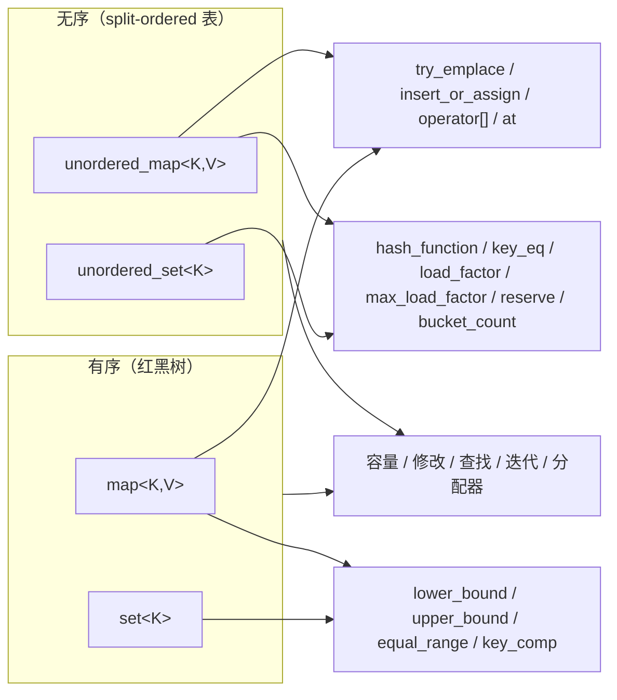

# API 参考

本库在 `mpmc` 命名空间中提供四种并发容器，每种容器对应一个头文件：

| 容器                 | 头文件                           | 底层引擎               |
|----------------------|----------------------------------|------------------------|
| `mpmc::unordered_map` | `mpmc/mpmc_unordered_map.hpp`    | 无锁 split-ordered 表  |
| `mpmc::unordered_set` | `mpmc/mpmc_unordered_set.hpp`    | 无锁 split-ordered 表  |
| `mpmc::map`          | `mpmc/mpmc_map.hpp`              | 并发红黑树             |
| `mpmc::set`          | `mpmc/mpmc_set.hpp`              | 并发红黑树             |

所有容器均为 header-only、C++11、单头文件、MIT 许可，可被任意数量的线程并发安全地使用。API 与对应的 std 容器保持一致；差异见「与 std 的差异」。



## 模板参数

```cpp
template <typename Key,
          typename T,
          typename Hash   = std::hash<Key>,
          typename KeyEqual = std::equal_to<Key>,
          typename Allocator = std::allocator<std::pair<const Key, T>>,
          typename Reclamation = mpmc::reclamation::default_scheme>
class unordered_map;

template <typename Key,
          typename Compare = std::less<Key>,
          typename Allocator = std::allocator<std::pair<const Key, Key>>,
          typename Reclamation = mpmc::reclamation::default_scheme>
class map;
```

`mpmc::unordered_set` 与 `mpmc::set` 遵循相同模式，值类型直接作为元素类型。

* `Reclamation` 取 `mpmc::reclamation::hazard_pointer` 或 `mpmc::reclamation::epoch`（见 docs/RECLAMATION_zh.md）。默认值由基准测试结果决定（见 docs/PERF_zh.md）。
* `Key` 必须为 nothrow 拷贝构造且 nothrow 析构（由 `static_assert` 强制）；映射类型 `T` 同理。值不会在加锁或受保护区域内被拷贝。
* 迭代器与引用在对应元素被删除前保持有效；除此之外不提供稳定地址保证。
* `Allocator` 必须是 C++11 分配器（符合 `std::allocator_traits`）。支持有状态分配器：每个容器保存其构造时的实例，节点经回收管线归还给同一实例。

## 通用操作

四种容器均支持：

* **容量** — `empty()`、`size()`（精确的原子计数器，不是近似值）、`max_size()`。
* **修改** — `emplace(args...)`、`insert(value)`、`erase(key)`（返回删除个数，0 或 1）、`erase(iterator)`、`clear()`。
* **查找** — `find(key)`（迭代器/const 迭代器）、`contains(key)`、`count(key)`。
* **迭代** — `begin()`、`end()`、`cbegin()`、`cend()`。迭代器是**弱一致的**（见下）。迭代为只读：迭代期间并发修改是安全的，但访问到的元素集合不确定。
* **分配器** — `get_allocator()`（返回容器构造时使用的分配器；支持有状态分配器，其标识在构造时被保存，而不是返回一个默认构造的实例）。

两个 map 额外支持 `try_emplace(key, args...)`、`insert_or_assign(key, obj)`、`operator[](key)`（不存在时插入默认值）与 `at(key)`（不存在时抛出 `std::out_of_range`）。`mpmc::map`/`mpmc::set` 增加 `lower_bound(key)`、`upper_bound(key)`、`equal_range(key)`、`key_comp()`。`mpmc::unordered_map`/`mpmc::unordered_set` 增加 `hash_function()`、`key_eq()`、`load_factor()`、`max_load_factor()`、`reserve(n)`、`bucket_count()`。

所有返回或检查元素的操作（find、at、迭代、边界、contains、count）都是**无锁的**：无论其他线程在做什么，它们都不会阻塞。修改操作（insert、erase、clear）可能会短暂阻塞以与其他并发修改协调。

## 元素生命周期与析构契约

节点内存由库内部经回收方案管理（见 [docs/RECLAMATION_zh.md](docs/RECLAMATION_zh.md)）；调用方从不释放节点。由此产生的约定：

* 从容器获得的指针或迭代器在元素被删除前保持有效。删除之后，节点随时可能被回收；解引用过期迭代器是调用方错误。
* `clear()` 与析构函数要求**独占访问**：此时不得有其他线程正在对该容器执行操作，且所有用户线程在析构前必须已 join。这是文档化约定，而非强制机制；违反即未定义行为。
* 操作间隙中所有退休节点均已证明不可达，因此析构函数可以释放每个节点与每笔待处理退休；析构后分配器的 allocate/deallocate 计数精确平衡（测试套件以计数分配器断言）。

## 并发语义

* **线性一致性** — 每个操作都在其执行期间的某个时点原子生效（逐容器论证见 docs/DESIGN_zh.md）。
* **弱一致迭代器** — 迭代访问一个类似快照的视图，但不保证反映所有并发修改；并发插入的元素可能被访问也可能不被访问；并发删除的元素在回收后绝不会被解引用。
* **读写互不阻塞** — 读者不会等待写者，写者也不会等待读者；只有写者之间需要协调。

## 异常行为

* map 的 `at(key)` 在键不存在时抛出 `std::out_of_range`（const 与非 const 重载）。
* 分配失败以分配器的异常传播（通常是 `std::bad_alloc`）。抛出路径上容器不变量得以保持：失败的插入不改变容器；节点池的簿记一致回滚（跟踪退休对象的向量在构造上保持对齐）。
* `Key`/`T` 要求 nothrow 拷贝构造与 nothrow 析构，因此值操作本身不会抛出；唯一可能抛出的是分配器调用与 `at()`。
* 对并发组合不提供异常安全保证：若某线程在操作中途抛出，该操作无可见效果，其他线程的操作正常继续。

## 审计钩子

`mpmc::map` 提供几个调试/审计方法（不属于 std 接口），便于测试使用：

* `dbg_validate()` — 遍历整个结构并检查核心不变量（BST/表的有序性、可达节点数与 `size()` 一致）。
* `dbg_max_depth()` — 最大根到叶深度（有序容器）。
* `dbg_rb_valid()` — 完整红黑树不变量检查（无红红、所有路径黑高相等）。
* `dbg_dump_rb()` — 打印每个节点及其颜色与黑高。

这些方法为 O(n)，只能在没有其他线程修改容器时调用，用于测试。

## 与 std 的差异

以下 std 接口**有意不提供**：

* 拷贝构造与拷贝赋值（容器不可拷贝；也不提供移动构造）。并发容器无法在使用中通过拷贝安全地快照。
* `swap()` — 无法原子地交换两个并发访问容器的内部状态。可用 `std::unique_ptr` 式间接层，或 `clear()` 后重新插入。
* 带提示的 `insert`（`insert(pos, value)`）与范围 `insert`（`insert(first, last)`）——提示对无锁结构没有意义；范围插入用循环即可等价实现。
* 桶迭代（unordered 容器的 `begin(n)`/`end(n)`/`bucket(key)`）——桶边界是 split-ordered 表的内部实现细节，扩容时会变化。
* set 容器的 `operator[]`/`at`（std 中同样不存在）。
* `erase_if`、异构查找（C++20 特性，超出 C++11 基线范围）。
* `clear()` 是独占操作：其他线程处于同一容器的操作中时不得调用（文档约定，仅靠自律保证）。
* `erase(iterator)` 与 std 相同，返回下一个元素的迭代器。unordered 容器的迭代器不能用来推导桶归属（不暴露桶迭代）。

`size()` 是精确且廉价的（原子计数器）——std 允许 `unordered_map::size()` 为 O(n)，这里为 O(1)。
