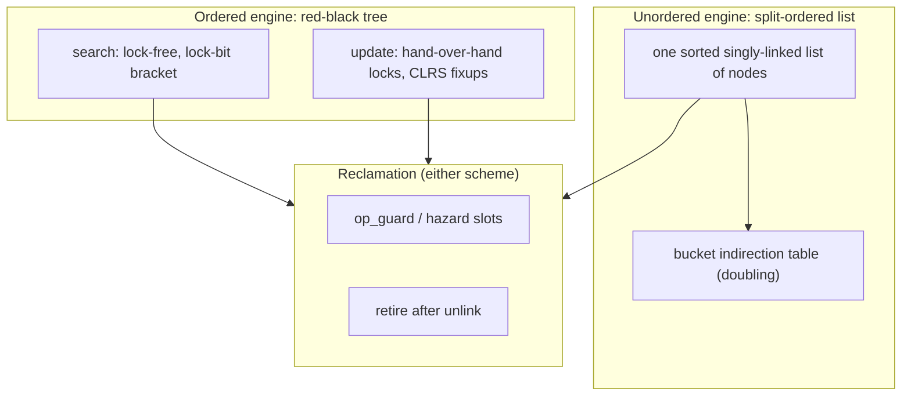
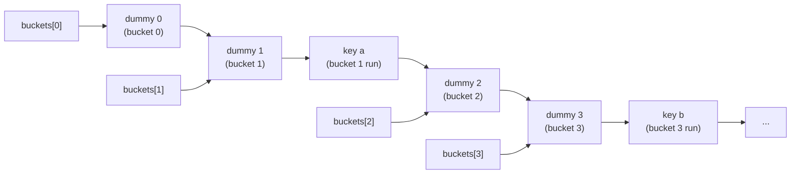
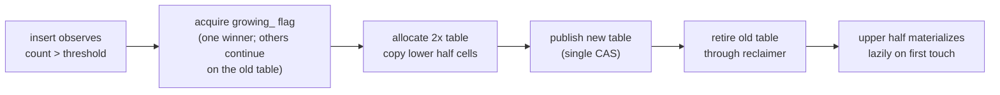
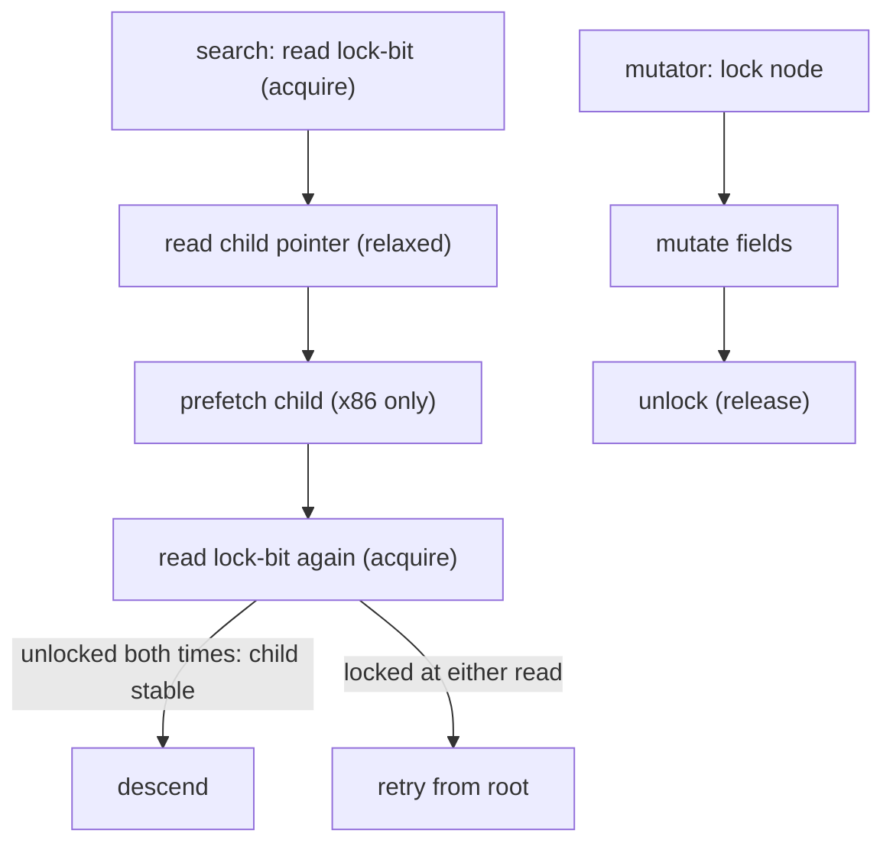
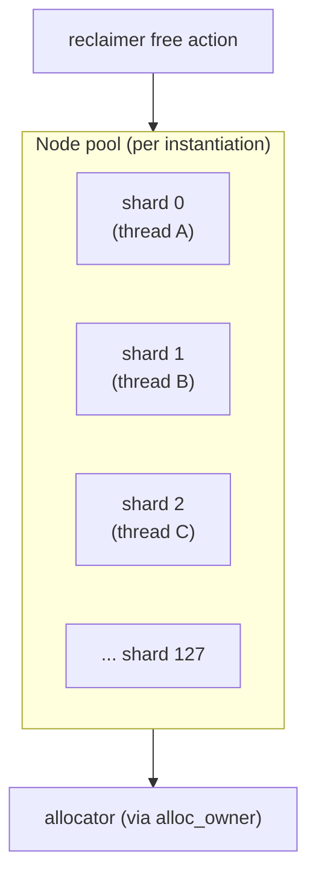

# Design

This document explains how the four containers work, the correctness
argument each part carries, and the honest limitations.

## Overview

Two engines, four containers:

1. **Split-ordered list** (Shalev & Shavit, 2003) -- `mpmc::unordered_map`
   and `mpmc::unordered_set`. Fully lock-free: inserts, erases and
   resizes all proceed by compare-and-swap on atomic next-pointers.
2. **Concurrent red-black tree** -- `mpmc::map` and `mpmc::set`.
   Lock-free searches (no blocking, no locks taken) plus a
   hand-over-hand locking update path. The tree itself is not fully
   lock-free; the reasons are given in
   [Tree update path](#tree-update-path).

Both engines integrate the same reclamation layer
(see [docs/RECLAMATION_en.md](docs/RECLAMATION_en.md)) and follow the
same memory-safety discipline:

> **Publish a pointer as protected before using it, and retire an
> object only after it has been unlinked from the structure.**

---

## Split-ordered list (unordered containers)

### Structure

The table is a single sorted singly-linked list (conceptually) of bucket
nodes and element nodes, plus a small indirection table of bucket
pointers:

* Every element node carries a `so_key = bit-reverse(hash(key))`
  (collisions resolved by the natural hash order). Bit-reversal makes
  bucket boundaries stable under resize.
* Bucket nodes are sentinel elements carrying a `bucket(k)` key and a
  **tag bit** in their next-pointer (bit 1 = "bucket node"). A bucket
  node for bucket `b` marks the position where elements of `b`'s range
  begin.
* `next` is a tagged atomic pointer: bit 0 = marked (logically
  deleted), bit 1 = bucket flag. Collisions -- elements whose hashes
  map to the same bucket -- form runs of equal `so_key`s between
  consecutive bucket nodes; the hash-mix is chosen so these runs stay
  small in practice.

Each bucket cell points at its dummy; the list order is the
bit-reversed bucket order, so walking from a dummy stays inside that
bucket's segment until the next dummy.

### Operations

* **Search**: walk the list comparing `so_key`s; a search never blocks.
  The traversed pointer is published to the reclamation guard *before*
  dereference and re-validated against the load that produced it
  (ABA-safe). A fast path checks the first node in the target run
  before entering the scan loop -- in the common case (run length 1,
  no hash collision) the loop is skipped entirely. The same fast path
  applies to insert and erase: insert checks the first node and
  returns `INSERT_DUPLICATE` immediately if it matches; erase checks
  the first node and fires the mark CAS directly if it is the target.
* **Insert**: locate the predecessor by key; publish the expected
  pointer; CAS the new node in. The CAS **refuses a marked
  predecessor** -- inserting after a logically deleted node would
  orphan the new node when the eraser detaches it.
* **Erase**: mark the node (CAS bit 0), then unlink-loop: locate the
  predecessor by *pointer* (not key -- pointers are unique), CAS it
  past the marked node, retry until detached, and only then retire the
  node.
* **operator[]**: when the key is absent, `operator[]` inserts a new
  node and returns a reference to its mapped value directly from the
  node just linked -- no second lookup. The duplicate-key path still
  needs a find to locate the existing element.

### Resize

An indirection table of bucket pointers is doubled when an insert
observes the load factor exceeded, and on `reserve()`. Growing only
re-directs the new bucket pointers into the existing list -- items are
never moved, so resize is lock-free and incremental: a single
compare-and-swap publishes the new table; the old table is retired.
The tag bit lets a searcher skip a not-yet-inserted bucket correctly.

Supporting details:

* The `growing_` flag ensures only one thread copies the bucket array
  at a time; other threads proceed on the old table concurrently.
* When `count_` far exceeds the threshold, one `grow_once` acquisition
  loops to double multiple times (burst-insert catch-up).
* A cached growth threshold (relaxed atomic) keeps the common insert
  path from loading `table_`; only when `count_` exceeds the cache
  does the slow path load `table_` and verify. The cache is always a
  lower bound of the true threshold, so a stale value can only cause
  an unnecessary slow-path entry, never a skipped growth.

### Why it is linearizable

Every operation's effect is a single CAS on one node's next-pointer (or
a bounded sequence of such CASes), and every read path observes only
CAS-published states. The standard argument applies: each operation
takes effect at its successful CAS. Erase takes effect at its mark
(after which all searches stop returning the element) and unlinks
later -- the mark is the linearization point; the unlink exists only
for reclamation.

---

## Concurrent red-black tree (ordered containers)

### Concurrency model

* **Search** (`find`, `contains`, `count`, `lower_bound`,
  `upper_bound`, iteration) is lock-free: it descends with plain
  atomic reads and never blocks. The correctness protocol is the
  **lock-bit bracket**: every child-pointer read is bracketed by two
  reads of the node's lock bit (both `memory_order_acquire`). A
  mutator holds a node's lock for the entire time it mutates that
  node's fields; a search that observed the node unlocked before *and*
  after reading a child pointer read a stable pointer.

  The `compare()` between the two lock-bit loads is safe because the
  key is immutable (set at construction, never mutated) -- the second
  lock-bit check only needs to verify the *child pointer* was stable,
  not re-read the key. The child-pointer load itself uses
  `memory_order_relaxed`: the first `locked.load(acquire)` already
  established a happens-before from any mutator that locked+unlocked
  the node (the unlock is `locked.store(false, release)`), so the
  child pointer -- written under the lock -- is visible.

* **Updates** (`insert`, `erase`) lock the path root-to-leaf
  (hand-over-hand: strictly parent-before-child), then rebalance with
  the classic CLRS red-black fixups, then release. The fixup steps
  additionally lock the uncle/sibling/nephew nodes they touch.

### Lock ordering and deadlock freedom

All lock acquisitions are along directed tree edges, root to leaf:

* the main path: `root -> ... -> parent -> node`;
* the delete extension: `target -> successor -> ... -> leftmost`;
* fixup auxiliary edges: `g -> p`, `p -> w`, `w -> near`, `w -> far`,
  `g -> uncle`.

Every edge is a parent-to-child edge of the *current* tree, so the
lock-order graph is acyclic (it is a subgraph of the tree). A mutator
that needs `A`'s lock while holding `B`'s always has `A` a descendant
of `B`; two mutators can therefore never wait on each other's locks in
a cycle. Deadlock is impossible.

### Tree update details

* **Insert** links the new node under its parent (both locked), then
  runs the CLRS insert fixup driven by the locked path stack (the tree
  stores **no parent pointers** -- the path stack replaces them, which
  removes an entire class of races on parent links).
* **Delete with at most one child** unlinks the target directly and
  runs the CLRS delete fixup. The fixup's `x` is the target's child
  (or null); its side is the target's side under its parent.
* **Delete with two children** relinks the in-order **successor node**
  into the target's position (the key of `std::pair<const Key, T>` is
  immutable, so values cannot be swapped). The successor's path is
  locked as an extension of the target's path. The double black
  created by removing the (black) successor sits where the successor
  used to be: at the successor's old right slot -- so the fixup starts
  at the successor itself when the successor was the target's right
  child, and at the successor's parent otherwise. All fixup rotations
  and rewires happen on locked nodes.
* **Root special case**: the root pointer can change only while the
  old root's lock is held (a fixup rotation at the root, or an erase
  of the root). A mutator that waits for the root's lock therefore
  re-verifies the root pointer after acquiring it and retries if the
  root changed -- otherwise it would descend a subtree that is no
  longer the whole tree.
* **Reclamation**: a removed node is unlinked while locked and retired
  only after the unlink is complete. Searches hold the per-operation
  guard, so a removed node is never dereferenced after reclamation.

### Why the tree is not fully lock-free

Fully lock-free red-black trees exist only in research literature;
there is no usable reference implementation, and the standard
operations (especially the delete fixup, which touches the sibling,
nephews and uncle) require multi-pointer updates that are not
expressible as single CASes without intrusive metadata or unacceptable
complexity. This library instead provides what matters most in
practice: **searches that never block, plus writer coordination that
is provably deadlock-free**. The update path is serialized (see
[docs/PERF_en.md](docs/PERF_en.md)); that is a documented trade-off,
not an oversight.

### Node layout (cache-line aware)

The node struct places hot search fields first -- `left`, `right`,
`locked`, `color` -- so they occupy the beginning of the node's first
cache line. The cold fields (`payload`, `alloc_owner`) follow:
`payload` is only touched for key comparison and value access;
`alloc_owner` is only used during allocation and reclamation. This
layout minimizes the bytes transferred on the search path: a search
visiting N nodes loads only the hot fields of each, and keeping them
compact in the first cache line avoids pulling in the (potentially
large) payload under read contention.

### Software prefetch

Both traversal hotspots issue `_mm_prefetch(addr, _MM_HINT_T0)` to
overlap cache-line fetches with computation:

1. **Tree search** (`search`, `bound_node`, `first_node`): after the
   child pointer is loaded (relaxed) and before the second lock-bit
   acquire check, the child node's cache line is prefetched into L1.
   RB-tree descent visits nodes in random memory order, so each child
   pointer typically targets a cold cache line. The prefetch hides
   50-100 cycles of L2/L3 latency behind the lock-bit bracket
   validation work.

2. **Unordered locate** (split-ordered list walk): at the top of each
   iteration, the next node's cache line is prefetched from a single
   `acquire` load of `cur->next`. The walk is a dependent load chain --
   each `next` pointer lives on a different cache line -- so starting
   the fetch early overlaps the miss with the marked-node CAS or
   `protect_from` work on the current node. The same single-load +
   prefetch pattern applies to every dependent-load-chain traversal in
   the walk family (`first_node`, `next_node` phases 1/2, and the
   `find_node`/`insert_node`/`erase_node` slow-path run scans); the
   prefetch address is `tags::clear(rnx)` because the raw tagged value
   may carry the mark bit.

Prefetches are guarded by `__x86_64__` / `_M_X64` / `__i386__` /
`_M_IX86` macros and compile to no-ops on other architectures.

---

## Memory management discipline (both engines)

1. Publish a pointer to the reclamation guard **before** dereferencing
   it; re-validate after reading (ABA protection). The epoch scheme
   skips re-validation at compile time: the per-operation guard already
   proves the node stays alive, and the CAS/scan layers handle stale
   reads.
2. Unlink a node **before** retiring it; never retire a still-linked
   node.
3. On erasure, the marking step is the linearization point; the unlink
   step exists only to make reclamation safe.
4. The container destructor frees the remaining structure directly and
   drains the reclaimer; this requires the documented destruction
   contract (no thread inside an operation; all user threads joined).
   The tree frees its remaining nodes with an iterative stack-based
   walk (no recursion, no link rewriting). A fold-based walk that
   rewired the left spine was rejected after review: every fold level
   targets the same leftmost leaf, so each fold overwrites the
   previous fold and orphans whole subtrees -- the allocator-balance
   test caught the resulting leak, and the walk was rewritten.

### Node pools

Retired nodes are not returned to the allocator directly: each
container instantiation owns a shared node pool (a static member,
guarded by short spin locks -- the critical sections are a few
nanoseconds, and the container data structures themselves stay
lock-free). Churn-heavy workloads therefore reuse hot blocks instead
of hitting the allocator.

The pool tracks the allocator each block was allocated with (the
node's `alloc_owner`); a pooled block is reused only by a container
using the same allocator instance and is otherwise released through
its own allocator. The pool drains when it exceeds its watermark
(bounded memory retention) and in every container destructor, so the
allocator's allocate/deallocate balance is preserved and no pooled
block outlives its allocator. The pool is shared per instantiation
rather than per container instance because the reclaimer's free
actions are shared across the instances of one type and may run after
any single instance has been destroyed.

Since the latest revision the pool is **sharded**: 128
cache-line-separated shards, each thread assigned its own shard on
first use (one amortized global fetch-add; the shard index is
thread-local, the pool itself remains a per-instantiation static).
Concurrent acquire/release from different threads therefore never
touch the same cache line. Each shard drains at its share of the
watermark (total retention bounded); the container destructor drains
all shards.

## What the tests verify

* **Unit** -- randomized oracle tests against
  `std::map`/`std::set`/`std::unordered_map` (fixed seeds), growth,
  two-children relink patterns, semantics, iteration, bounds, leaks,
  both schemes.
* **Stress** -- concurrent mixed workloads with per-key last-operation
  oracles and RNG-replay verification of the final state, both
  schemes, counting allocators, leak checks. The stress harness takes
  an optional thread count, and the 16-thread matrix (both engines,
  both schemes) is part of the verification record.
* **Balance regression** -- `dbg_degenerate` replays a deterministic
  op stream and checks the red-black invariants after *every*
  operation; this catches rebalancing drift that order/size oracles
  cannot see.
* **Allocator balance** -- `test_pool` churns containers backed by
  counting stateful allocators (same and distinct instances, both
  schemes, both engines) and asserts allocate == deallocate after
  destruction; it caught and regression-guards the tree destructor
  leak.
* **Negative compile** -- throwing-copy keys are rejected at compile
  time for all four containers.
* **Sanitizers** -- UBSan (clang) and AddressSanitizer (MSVC) across
  the full suite.
