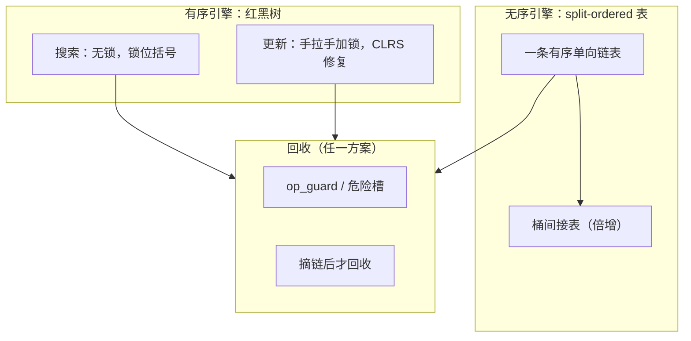
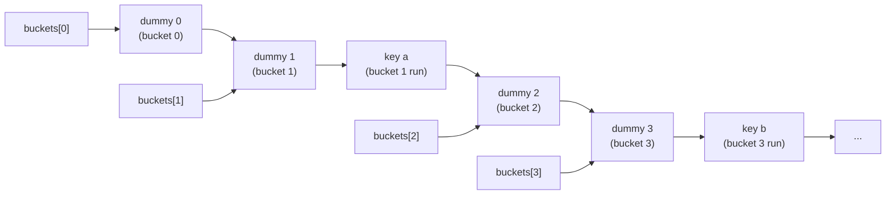
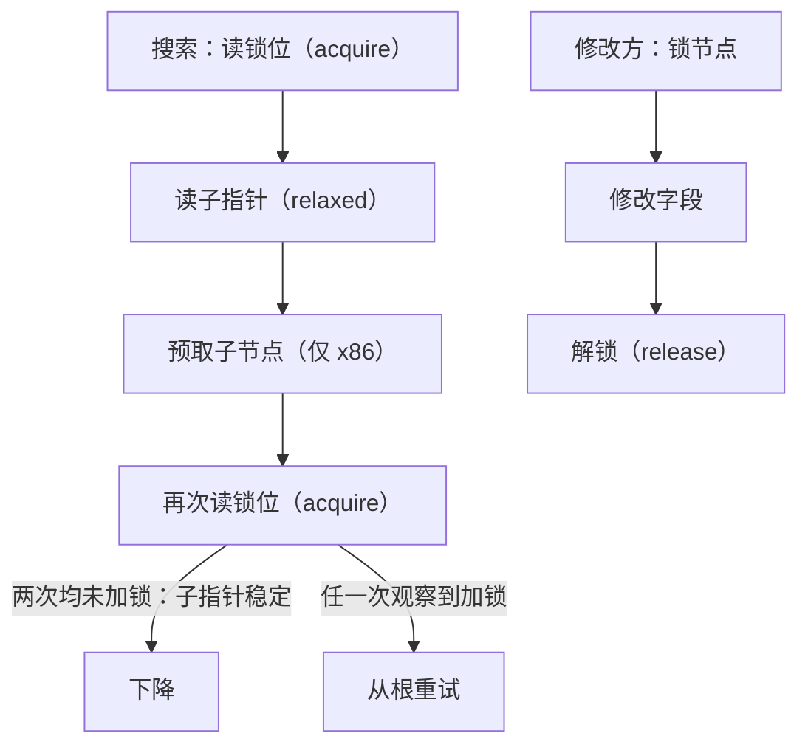
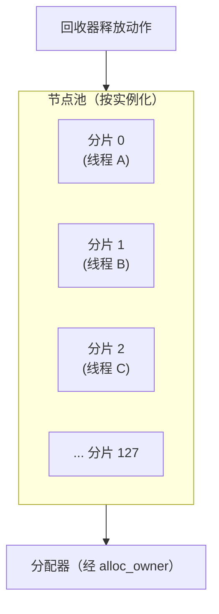

# 设计

本文说明四种容器的工作原理、各部分的正确性论证，以及如实记录的局限。

## 总览

两个引擎、四个容器：

1. **Split-ordered list**（Shalev & Shavit, 2003）—— `mpmc::unordered_map` 和 `mpmc::unordered_set`。完全无锁：插入、删除、扩容全部通过原子 next 指针上的比较交换（CAS）完成。
2. **并发红黑树** —— `mpmc::map` 和 `mpmc::set`。无锁搜索（不阻塞、不加锁）加手拉手（hand-over-hand）加锁更新路径。树本身并非完全无锁；原因见「树的更新路径」。

两个引擎共享同一套内存回收层（见 [docs/RECLAMATION_zh.md](docs/RECLAMATION_zh.md)），并遵循相同的内存安全纪律：

> **先发布指针再使用，且只在节点已从结构中摘除后回收。**

---

## Split-ordered 表（unordered 容器）

### 结构

表是一个（概念上的）有序单向链表，包含"桶"节点与元素节点，外加一张小的桶指针间接表：

* 每个元素节点携带 `so_key = bit-reverse(hash(key))`（碰撞按哈希自然序排列）。位反转使桶边界在扩容时保持稳定。
* 桶节点是携带 `bucket(k)` 键的哨兵元素，其 next 指针有**标记位**（bit 1 = 桶节点）。桶 `b` 的桶节点标记 `b` 范围元素的起始位置。
* `next` 是带标记的原子指针：bit 0 = 已标记（逻辑删除），bit 1 = 桶标志。哈希相同的元素在相邻桶节点之间形成 `so_key` 运行；哈希混合函数保证这些运行在实践中小而短。

每个桶单元指向其 dummy；链表顺序为桶序的位反转序，因此从某个 dummy 出发的遍历在其桶段内保持，直到下一个 dummy。

### 操作

* **搜索**：按 `so_key` 遍历链表，从不阻塞。被遍历的指针在解引用*之前*发布到回收守卫，并在读取后与产生它的那次加载重新校验（防 ABA）。**快速路径**在进入扫描循环前检查目标 run 的第一个节点——常见情况下（run 长度为 1，无哈希碰撞）循环完全跳过。同样的快速路径应用于插入和删除：插入检查第一个节点，若匹配则立即返回 `INSERT_DUPLICATE`；删除检查第一个节点，若为目标则直接发起标记 CAS。
* **插入**：按键定位前驱；发布期望指针；CAS 接入新节点。CAS **拒绝已标记的前驱**——在逻辑已删除节点之后插入会在删除方摘链时孤立新节点。
* **删除**：先标记节点（CAS bit 0），再摘链循环：按*指针*（而非键，指针唯一）定位前驱，CAS 将其越过被标记节点，失败重试直到摘除，然后才回收节点。
* **operator[]**：当键不存在时，`operator[]` 插入新节点，直接从刚链入的节点返回其映射值的引用——无需第二次查找。重复键路径仍需查找以定位已有元素。

### 扩容

当一次插入观察到负载因子超限时（以及 `reserve()` 时），桶指针间接表翻倍。扩容只是把新桶指针重新指向现有链表——元素从不移动，因此扩容无锁且增量完成：一次 CAS 发布新表，旧表经回收器退役。标记位让搜索者能正确处理尚未插入的桶。

支撑细节：

* `growing_` 标志确保仅一个线程拷贝桶数组；其他线程并发地在旧表上操作。
* 当 `count_` 远超阈值时，一次 `growing_` 获取内循环多次翻倍（突发插入追赶）。
* 缓存增长阈值（relaxed atomic）让常见插入路径免于加载 `table_`；仅当 `count_` 超过缓存值时才走慢路径加载 `table_` 验证。缓存值始终是真实阈值的下界，过期值只会多走慢路径，绝不会跳过必要的扩容。

### 为何线性一致

每个操作的效果是对某个节点 next 指针的一次 CAS（或有界 CAS 序列），所有读路径只观察 CAS 发布的状态。标准论证成立：每个操作在其成功的 CAS 处生效。删除在标记处生效（此后所有搜索不再返回该元素），摘链稍后执行——标记是线性化点；摘链只服务于回收安全。

---

## 并发红黑树（有序容器）

### 并发模型

* **搜索**（`find`、`contains`、`count`、`lower_bound`、`upper_bound`、迭代）无锁：仅用普通原子读下降，从不阻塞。正确性协议是**锁位括号**：每次读子指针都被该节点锁位的两次读取（均为 `memory_order_acquire`）夹住。修改方持有节点锁期间才会修改该节点字段；搜索在读取子指针前后都观察到节点未加锁，就读取到了稳定指针。

  两次锁位加载之间的 `compare()` 是安全的，因为键不可变（构造时设定，永不修改）——第二次锁位检查只需验证*子指针*稳定，无需重读键。子指针加载本身使用 `memory_order_relaxed`：首次 `locked.load(acquire)` 已建立与任何加锁后解锁的修改方的 happens-before（解锁为 `locked.store(false, release)`），故在锁下写入的子指针可见。

* **更新**（`insert`、`erase`）自根到叶手拉手加锁（严格父子顺序），然后用经典 CLRS 红黑修复旋转，最后释放。修复步骤会额外锁定涉及的叔/兄弟/侄节点。

### 锁序与无死锁

所有锁的获取都沿有向树边、根到叶：

* 主路径：`root -> ... -> parent -> node`；
* 删除扩展：`target -> successor -> ... -> leftmost`；
* 修复辅助边：`g -> p`、`p -> w`、`w -> near`、`w -> far`、`g -> uncle`。

每条边都是*当前*树的父到子边，因此锁序图无环（是树的子图）。持有 `B` 的锁而要 `A` 的锁的修改方，必有 `A` 是 `B` 的后代；两个修改方不可能在锁上成环等待。死锁不可能发生。

### 树更新细节

* **插入** 在父节点（已加锁）下接入新节点，然后用锁定的路径栈驱动 CLRS 插入修复（树**不存父指针**——路径栈取代了它，消除了整类父链竞争）。
* **至多一个孩子的删除** 直接摘除目标，运行 CLRS 删除修复。修复的 `x` 是目标的孩子（或空）；其侧别是目标在其父下的侧别。
* **两个孩子的删除** 把中序**后继节点**重链到目标位置（`std::pair<const Key, T>` 的键不可变，无法交换值）。后继路径作为目标路径的扩展加锁。删除（黑色）后继产生的双黑位于后继原位置：后继是目标右孩子时，双黑在后继自身的右槽，修复从后继自身开始；否则从后继的父开始。所有修复旋转与重链都在已加锁节点上进行。
* **根的特殊情况**：根指针只可能在旧根锁被持有的情况下改变（根处修复旋转，或删除根）。因此等待根锁的修改方在获得锁后必须**重新校验根指针**，变了就重试——否则会沿一个不再是整棵树的子树下降。
* **回收**：被删除节点在加锁状态下摘除，摘除完成后才回收。搜索持有每次操作的守卫，因此被删除节点绝不会在回收后被解引用。

### 为何树不做到完全无锁

完全无锁的红黑树只存在于研究文献中，没有可用的参考实现；标准操作（尤其是涉及兄弟、侄、叔的删除修复）需要多点指针更新，无法用单个 CAS 表达，除非引入侵入式元数据或难以接受的复杂度。本库给出实践中最有价值的部分——**不阻塞的搜索，加上可证明无死锁的写者协调**。更新路径是串行化的（见 [docs/PERF_zh.md](docs/PERF_zh.md)）；这是文档化的权衡，不是疏漏。

### 节点布局（缓存行感知）

节点结构将热搜索字段放在前面——`left`、`right`、`locked`、`color`——使其占据节点首个缓存行的起始位置。冷字段（`payload`、`alloc_owner`）在后：`payload` 仅在键比较和值访问时触及；`alloc_owner` 仅在分配和回收时使用。此布局最小化搜索路径上的字节传输：搜索访问 N 个节点时仅加载每个节点的热字段，将其紧凑排列在首个缓存行中，避免读争用下拉入（可能较大的）payload。

### 软件预取

两个遍历热点发出 `_mm_prefetch(addr, _MM_HINT_T0)` 以将缓存行拉取与计算重叠：

1. **树搜索**（`search`、`bound_node`、`first_node`）：子指针加载（relaxed）后、第二次锁位 acquire 检查前，预取子节点缓存行到 L1。红黑树下降以随机内存顺序访问节点，每个子指针通常指向冷缓存行。预取可将 50-100 周期的 L2/L3 延迟隐藏在锁位括号验证工作之后。

2. **unordered locate**（split-ordered list 遍历）：每次迭代顶部，从单次 `acquire` 加载 `cur->next` 获得地址后预取下一节点缓存行。遍历是依赖加载链——每个 `next` 指针在不同缓存行上——提前发起拉取可将未命中与当前节点的标记 CAS 或 `protect_from` 工作重叠。同样的"单次加载 + 预取"模式应用于遍历家族中的每条依赖加载链（`first_node`、`next_node` 阶段 1/2、以及 `find_node`/`insert_node`/`erase_node` 慢路径 run 扫描）；预取地址使用 `tags::clear(rnx)`——因为原始标记值可能携带 mark 位。

预取指令由 `__x86_64__` / `_M_X64` / `__i386__` / `_M_IX86` 宏守护，在其他架构上编译为空操作。

---

## 内存管理纪律（两个引擎通用）

1. 解引用*之前*把指针发布到回收守卫；读取后重新校验（ABA 防护）。epoch 方案在编译期跳过重新校验：每操作守卫已证明节点存活，CAS/扫描层处理陈旧读取。
2. 回收*之前*先摘链；绝不回收仍在链上的节点。
3. 删除时，标记步骤是线性化点；摘链步骤只为回收安全存在。
4. 容器析构函数直接释放剩余结构并排空回收器；这要求文档化的析构契约（无线程处于操作中；所有用户线程已 join）。树用迭代式栈遍历释放剩余节点（无递归、无重链）。曾经尝试过一种折叠式遍历（把右子树重链到左脊柱），审查后被否决：每一层折叠都指向同一个最左叶子，后一次折叠会覆盖前一次并孤立整棵子树——分配器平衡测试发现了由此产生的泄漏，遍历已被重写。

### 节点池

退休节点不会直接归还分配器：每个容器实例化共享一个节点池（静态成员，由短自旋锁保护——临界区只有几纳秒，容器数据结构本身保持无锁）。高换手负载因此复用热块而不是频繁触碰分配器。

池记录每个块分配时的分配器（节点的 `alloc_owner`）；池化块只被使用同一分配器实例的容器复用，否则通过其自身分配器释放。池超过水位线（有界内存驻留）以及每个容器析构时都会排空，因此分配器的 allocate/deallocate 平衡得到保持，池化块不会比其分配器活得更久。池按实例化共享而非按容器实例共享，因为回收器的释放动作在同一类型的各实例间共享，且可能在任一实例销毁后运行。

自最近一次修订起，节点池已**分片**：128 个缓存行隔离的分片，每线程首次使用时分配自己的分片（一次均摊的全局 fetch_add；分片索引为线程局部，池本身仍是每实例化的静态成员）。不同线程的并发 acquire/release 因此永不触及同一缓存行。每个分片在其水位份额处排空（总驻留有界）；容器析构函数排空所有分片。

## 测试验证了什么

* **单元** —— 对照 `std::map`/`std::set`/`std::unordered_map` 的随机化 oracle 测试（固定种子）、增长、两孩子重链模式、语义、迭代、边界、泄漏、两种方案。
* **压力** —— 并发混合负载，带每键最后操作 oracle 和 RNG 重放校验最终状态，两种方案、计数分配器、泄漏检查。压力测试接受可选的线程数参数；16 线程矩阵（两个引擎、两种方案）属于验证记录的一部分。
* **平衡回归** —— `dbg_degenerate` 重放确定性操作流并在*每次*操作后检查红黑不变量；可捕捉顺序/大小 oracle 无法发现的再平衡漂移。
* **分配器平衡** —— `test_pool` 用计数式有状态分配器换手多个容器（同实例与不同实例、两种方案、两个引擎），断言析构后 allocate == deallocate；它发现并回归防护了树析构泄漏。
* **负向编译** —— 四种容器都在编译期拒绝可抛异常的键类型。
* **消毒器** —— UBSan（clang）与 AddressSanitizer（MSVC）跑完整测试套件。
