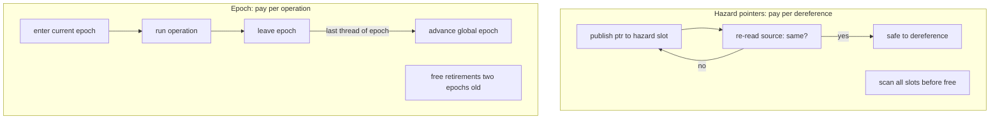

# Memory reclamation

Both container engines are parameterized on a memory-reclamation scheme.
Two schemes are implemented and tested through the same interface; the
default is selected from the benchmark results in
[docs/PERF_en.md](PERF_en.md).

```cpp
mpmc::reclamation::hazard_pointer   // hazard pointers (Michael-style)
mpmc::reclamation::epoch            // global epoch (Fraser / Harris style)
mpmc::reclamation::default_scheme   // = epoch (measured; see PERF_en.md)
```

Both schemes expose the same uniform interface, so the container code is
identical for either scheme:

- `op_guard` -- RAII per-operation guard; a thread inside a guard may
  dereference any pointer it read during the operation.
- `protect(slot, ptr)` / `clear(slot)` -- publish/retract a pointer
  (no-ops for the epoch scheme).
- `retire(ptr, action)` -- schedule `action.run(ptr)` once no thread can
  still dereference `ptr`.
- `reclaim()` -- best-effort free of provably safe retirements.
- `drain_all()` / `has_outstanding()` -- destruction-contract support
  and leak assertions.

`retire_action` is a function pointer paired with the object's own
allocator pointer (`node::alloc_owner`): objects free themselves
through the allocator they were allocated with, so instantiations with
different (or stateful) allocators never cross-free.

## The shared problem

A node removed from a container cannot be freed at removal time: another
thread may be mid-operation on it (holding a pointer read from the
structure, or a pointer about to be read). Both schemes implement the
same rule with different mechanisms:

> A pointer is retired only after the node was unlinked from the
> structure, and freed only when no concurrently running operation can
> still dereference it.

The two mechanisms differ in what they pay per operation and per
retirement:



## Hazard pointers

Every pointer dereference in a traversal is first published to a
per-thread hazard slot, then re-validated against the load that produced
it (the source is read again; if it changed, the walk restarts). A
reclaimer scans all live hazard slots before freeing an object; if any
slot publishes it, the object stays alive.

Reclamation is immediate on success: once a scan shows no slot publishes
the object, it is freed. Memory is therefore bounded by the number of
retired-but-protected objects, which is bounded by the number of
concurrent operations.

### Thread exit

A thread that exits while some of its retirements are still protected
pushes them onto a shared late-retire chain. Any later scan, and every
container destructor, drains it, so nothing leaks when threads churn.
The chain is built with per-element compare-and-swaps at the head: a
whole-chain push would race (two pushers could cross their tail links
and form a cycle), so the per-element discipline is what makes the
chain cycle-free by construction.

### Cost profile

- constant per dereference: one atomic load for the source, one hazard
  slot write, one re-validation load;
- an O(threads x slots) scan per retirement batch (threshold-gated).

## Epoch

A global three-value epoch counter with per-epoch active counts. Every
operation enters the current epoch on its guard and leaves it on guard
destruction; the epoch advances only when the current epoch's active
count reaches zero (the last leaver attempts the CAS).

Objects are retired tagged with the epoch they were retired in and
freed only when the global epoch has passed that epoch by two
generations. Two generations, not one, because a thread may enter epoch
g while the last thread of epoch g-1 is still finishing: the
two-generation rule proves every thread that could have dereferenced
the object has completed the operation in which it did so.

### Reclaim scheduling

Each thread maintains a `retired_total` counter incremented on every
`retire()`. When it exceeds `MPMC_EPOCH_RECLAIM_THRESHOLD` (default
256), `reclaim()` runs, which frees the tag two epochs old. The counter
is re-derived from the surviving tagged lists after each partial
reclaim, so the threshold reflects outstanding retirements.

### Drain gating

`reclaim()` also drains the shared late-retire chain (populated by
exited threads, see thread exit below). The drain exchanges the chain
head -- a global locked read-modify-write on one cache line shared by
all threads -- so it is gated on two conditions:

1. the chain is non-empty (checked with a contention-free relaxed
   load), and
2. the global epoch has advanced since this thread last drained.

The second condition matters because under sustained multi-thread
activity the global epoch can remain frozen for long stretches (the
active count rarely reaches zero). Without the gate, every per-retire
reclaim would perform the exchange, and once threads exit and push
their backlogs onto the chain, the survivors would re-walk and
re-push the whole chain on every retire: O(chain) per retire. With the
gate, mid-run reclaims are O(1) and the chain is drained once per
epoch advance.

Deferred drains are safe: orphans stay on the chain until their tag
becomes reclaimable, and the destruction path (`drain_late_all`)
frees everything. The leak assertions and allocator-balance checks in
the test suite exercise this path under both schemes.

### Thread exit

Threads that exit with unreclaimable retirements push them onto the
shared late-retire chain, tagged, using the same per-element CAS
discipline as the hazard scheme. Any later reclaim, and every
container destructor, drains it.

### Cost profile

- per operation: one atomic load (the epoch) + one atomic increment
  (the active count) on entry, one decrement on exit;
- no per-dereference cost;
- the global epoch and its active counters are single contention
  points when many threads enter and exit simultaneously.

## Retired nodes and the node pool

Retired nodes are not returned to the allocator immediately: they are
pooled per container instantiation (see
[docs/DESIGN_en.md](docs/DESIGN_en.md)). The pool keeps hot blocks in
the reclamation pipeline instead of the allocator and keeps the
allocator's allocate/deallocate balance exact. Since the latest
revision the pool is sharded into 128 cache-line-separated shards, one
per thread, so concurrent pool traffic does not contend on a single
lock.

## Choosing a scheme

Measured on the reference machine (clang 17, Release, Windows x64;
full tables in [docs/PERF_en.md](docs/PERF_en.md)):

- epoch is faster for read-heavy workloads at every thread count
  (1.4-1.6x);
- epoch is faster for mixed workloads from 4 threads up;
- hazard pointers are within ~15% of epoch only at 1-2 threads on
  mixed churn.

The reason is structural: hazard pointers pay a protect/re-validate
sequence per dereference, epoch pays a fixed enter/exit cost per
operation. Epoch's retire path is also cheaper under contention.

The default is therefore `epoch`. Applications that publish
long-lived pointers and expect very high reader counts may still
prefer hazard pointers (which have no global contention point on the
read path); the scheme is passed explicitly in that case.

## Safety argument (common to both schemes)

The retirement rule -- unlink first, retire second, free only when
provably unreachable -- is enforced by the container discipline
documented in [docs/DESIGN_en.md](docs/DESIGN_en.md):

- hazard: no hazard slot publishes the object. Slots are written
  before any dereference and cleared only after the last dereference,
  so a slot holding the object means some thread may still use it;
- epoch: the epoch the object was retired in has provably no active
  thread (the two-generation rule above).

The stress suite exercises both arguments under both schemes with
counting allocators (allocate == deallocate asserted) and leak
assertions, including under AddressSanitizer.
