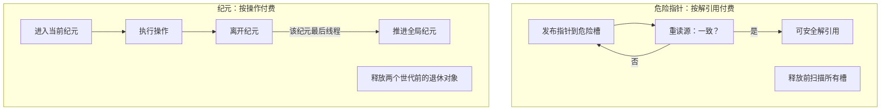

# 内存回收

两个容器引擎都按内存回收方案参数化。实现了两种方案，通过同一接口测试；默认方案由基准测试结果选定（见 [docs/PERF_zh.md](docs/PERF_zh.md)）。

```cpp
mpmc::reclamation::hazard_pointer   // 危险指针（Michael 式）
mpmc::reclamation::epoch            // 全局纪元（Fraser / Harris 风格）
mpmc::reclamation::default_scheme   // = epoch（实测选定，见 PERF_zh.md）
```

两种方案暴露相同的统一接口，因此容器代码对两种方案完全相同：

- `op_guard` — RAII 每操作守卫；守卫内的线程可以解引用它在本操作中读到的任何指针。
- `protect(slot, ptr)` / `clear(slot)` — 发布/撤销一个指针（epoch 方案为空操作）。
- `retire(ptr, action)` — 在证明没有线程还能解引用 `ptr` 后执行 `action.run(ptr)`。
- `reclaim()` — 尽力回收已证明安全的退休对象。
- `drain_all()` / `has_outstanding()` — 析构契约支持与泄漏断言。

`retire_action` 是函数指针加对象自身的分配器指针（`node::alloc_owner`）：对象通过自己分配时的分配器自释放，因此不同分配器（或带状态分配器）的容器实例绝不会交叉释放。

## 共同问题

节点从容器中摘除时不能立即释放：另一个线程可能正对它执行操作（持有从结构中读到的指针，或即将读取该指针）。两种方案以不同机制实现同一条规则：

> 指针只在节点已从结构摘除后退休，且只有在没有并发运行的操作还能解引用它时才释放。

两种机制的每操作成本与每批退休成本不同：



## 危险指针

遍历中的每次指针解引用都先发布到每线程危险槽，再与产生它的加载重新校验（重读源；若已变化则重新开始遍历）。回收方在释放对象前扫描所有活跃危险槽；只要有任何槽发布该对象，对象就保持存活。

扫描成功后回收立即进行：一旦显示没有槽发布该对象，即可释放。因此内存有界于"已退休但受保护"的对象数，后者有界于并发操作数。

### 线程退出

带着仍受保护退休对象退出的线程把它们推入共享的迟到退休链。任何后续扫描、以及每个容器析构函数都会排空它，线程来来去去也不会泄漏。链的构建使用头部逐元素 CAS：整链推入存在竞争（两个推入者可能交叉尾部链接形成环），逐元素纪律正是链在构造上无环的原因。

### 成本曲线

- 每次解引用常数开销：一次源原子读、一次危险槽写入、一次重校验读；
- 每批退休 O(线程数 × 槽数) 扫描（阈值门控）。

## 纪元

全局三值纪元计数器，带每纪元活跃计数。每个操作在其守卫上进入当前纪元，守卫析构时离开；只有当前纪元的活跃计数归零（最后离开者尝试 CAS）纪元才前进。

对象按其退休时的纪元打标签，只有当全局纪元已越过该纪元两个世代时才释放。需要两个世代而非一个，是因为某线程可能在纪元 g 的最后一个线程尚未结束时进入纪元 g：两世代规则证明所有可能解引用过该对象的线程都已结束相应操作。

### 回收调度

每线程维护 `retired_total` 计数器，每次 `retire()` 递增。超过 `MPMC_EPOCH_RECLAIM_THRESHOLD`（默认 256）时触发 `reclaim()`，释放两个世代前的标签。每次部分回收后计数器从存活的标记列表重新推导，使阈值反映未回收的退休数。

### 排空门控

`reclaim()` 还会排空共享的迟到退休链（由退出的线程填充，见下）。排空会交换链头——一个由所有线程共享的缓存行上的全局锁定读改写——因此以两个条件为门控：

1. 链非空（用无争用的 relaxed 加载检查）；
2. 全局纪元自本线程上次排空以来已前进。

第二个条件很重要：持续多线程活动下全局纪元可能长时间冻结（活跃计数难以归零）。若无门控，每次 retire 触发的回收都会执行该交换；一旦线程退出并把积压推入链中，幸存者会在每次 retire 时重走并重推整条链：每次 retire O(链长)。有门控时，运行中的回收为 O(1)，链在每次纪元前进时排空一次。

延迟排空是安全的：孤儿留在链上直到其标签可回收，析构路径（`drain_late_all`）释放全部。测试套件中的泄漏断言与分配器平衡检查在两种方案下都覆盖了这条路径。

### 线程退出

带着不可回收退休对象退出的线程把对象推入共享迟到退休链（带标签），使用与危险指针方案相同的逐元素 CAS 纪律。任何后续回收、以及每个容器析构函数都会排空它。

### 成本曲线

- 每操作：进入时一次原子读（纪元）+ 一次原子增量（活跃计数），退出时一次递减；
- 无每次解引用开销；
- 全局纪元及其活跃计数器在大量线程同时进出时是单一争用点。

## 退休节点与节点池

退休节点不会立即归还分配器：它们按容器实例化池化（见 [docs/DESIGN_zh.md](docs/DESIGN_zh.md)）。池让热块留在回收管线中而非分配器中，并保持分配器 allocate/deallocate 计数精确平衡。自最近一次修订起，池分为 128 个缓存行隔离的分片，每线程一个，并发池流量不再争抢单一锁。

## 方案选择

在参考机器（clang 17，Release，Windows x64；完整表格见 [docs/PERF_zh.md](docs/PERF_zh.md)）上实测：

- 读多负载下每个线程数 epoch 都更快（1.4-1.6 倍）；
- 混合负载下从 4 线程起 epoch 更快；
- 危险指针仅在 1-2 线程的混合换手下与 epoch 差距在约 15% 以内。

原因在于结构：危险指针每次解引用付一次 protect/re-validate 序列，epoch 每操作付固定进出成本。epoch 的退休路径在争用下也更便宜。

默认因此为 `epoch`。长期发布指针、读者数量极高的应用仍可显式指定危险指针（其读路径无全局争用点）。

## 安全论证（两种方案相同）

"先摘链、后退休、证明不可达后才释放"的规则由 [docs/DESIGN_zh.md](docs/DESIGN_zh.md) 中记录的容器纪律强制：

- 危险指针：没有任何危险槽发布该对象。槽在任何解引用前写入、只在最后一次解引用后清除，因此槽持有该对象意味着某个线程仍可能使用它；
- epoch：该对象退休时的纪元已证明没有活跃线程（上述两世代规则）。

压力套件在两种方案下以计数分配器（断言 allocate == deallocate）与泄漏断言验证了这两个论证，包括在 AddressSanitizer 下。
